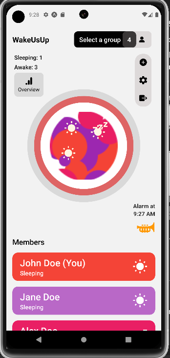
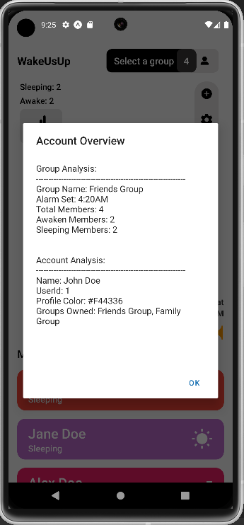

# Hello this is my app 
# WakeUsUP
-----------
 
## What is this app about? (UTILITY + SOCIAL = LET'S HELP EACH OTHER)
 WakeUsUp is a revolutionary app designed to bring people together with a common goal: waking up on time. Whether you're part of a study group, a fitness team, or just need a little extra motivation to rise and shine, WakeUsUp makes waking up a social experience.
 
 This app allows you to set alarms for your entire group, track each member's wake-up status, and hold each other accountable. With features like group-based alarm synchronization, sleep vs. awake tracking, and customizable reminders, you'll never feel like you're facing the alarm clock alone again.
 
 WakeUpUs connects you with your group through motivational tools, ensuring that no one sleeps through their alarm ever again. Get ready to say goodbye to those lonely mornings and hello to better, more productive starts to your day!
 
### Notable features of the app 
- Group Alarms: Set and sync alarms for all group members.
- Awake vs. Sleeping Stats: Track who’s up and who needs a little more time.
- Motivational Reminders: Keep each other accountable with friendly nudges.
- User Analytics: See your wake-up habits and group trends over time.
-----------
 
Screenshots of the app:
 

Video walkthrough of the app:
[https://www.youtube.com/watch?v=somevideoplaceholder](https://youtu.be/a46bjuOKru8?feature=shared)
 
 
------------
 
APK is coming soon. Have not learnt it yet :)
 
 
 
 
